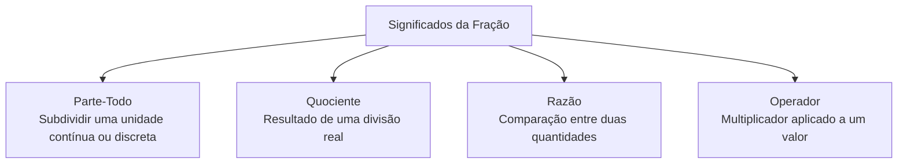
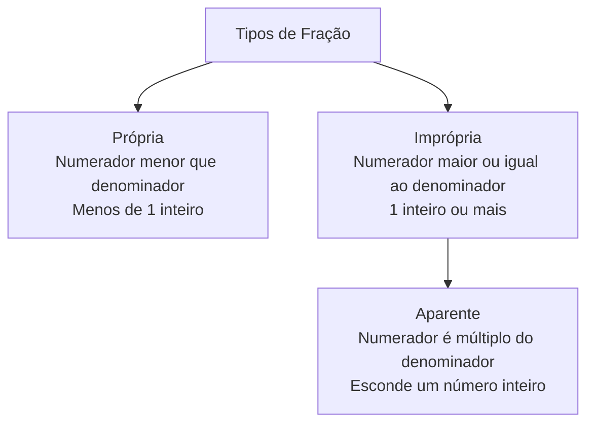

# Representação Fracionária dos Números Racionais: Reconhecimento, Significados e Reta Numérica

## Conceitos

### Por que precisamos de novos números?

Na nossa rotina diária com a Matemática, usamos os **números naturais** (como 0, 1, 2, 3, 4 e assim por diante) para fazer contagens simples de objetos inteiros. Com eles, conseguimos dizer quantas canetas temos no estojo, quantos livros há na mochila ou quantos alunos estão na sala de aula. 

Entretanto, no mundo real, muitas situações não podem ser explicadas usando apenas objetos inteiros. Imagine que você tem **uma única barra de chocolate** e deseja dividi-la igualmente entre você e um amigo. Se tentarmos usar apenas os números inteiros, a conta não fecha: não é possível dar 1 chocolate inteiro para cada um, nem deixar alguém com 0. 

Para resolver esse problema, precisamos "quebrar" ou "repartir" o chocolate em partes iguais. Cada um de vocês receberá um pedaço que é menor do que a barra inteira. Na Matemática, para representar essas partes de um todo, nós usamos uma nova categoria de números: os **números racionais**. A forma mais comum de escrever e representar esses números é através das **frações**.

---

### O que é uma fração?

Uma **fração** é a representação matemática de uma ou mais partes de um todo que foi dividido em partes iguais. Ela serve para nos dizer, de forma precisa, qual pedaço de um objeto ou de um grupo nós estamos considerando.

Toda fração é escrita com dois números separados por um traço horizontal. Veja o exemplo abaixo:

$$\frac{3}{4}$$

Essa representação possui dois termos fundamentais com papéis muito bem definidos:

* **O Denominador (o número de baixo)**: Ele indica em **quantas partes iguais** o todo foi dividido. No exemplo acima, o denominador é 4. Isso significa que o nosso objeto inteiro foi cortado em 4 pedaços de mesmo tamanho. O denominador funciona como o "nomeador" da fração, dando nome ao tipo de pedaço (se dividirmos em 4 partes, cada parte se chama "quarto").
* **O Numerador (o número de cima)**: Ele indica **quantas dessas partes** nós estamos pegando, pintando ou considerando. No exemplo acima, o numerador é 3. Isso significa que, das 4 partes em que dividimos o objeto, nós selecionamos 3. O numerador é o "contador", pois ele conta os pedaços.
* **O Traço de Fração (a barra do meio)**: Ele indica uma **operação de divisão**. A fração $$\frac{3}{4}$$ representa a divisão de 3 por 4.

#### Por que o denominador nunca pode ser zero?

Na Matemática, existe uma regra de ouro: **o denominador de uma fração nunca pode ser zero**. Vamos entender isso usando uma ideia bem simples.

Imagine que você tem uma torta de morango. Você pode optar por dividi-la em 2 partes, em 4 partes ou até em 8 partes iguais. Mas seria impossível dividir essa torta em "zero partes". Se você não fizer nenhum corte, a torta continuará inteira (ou seja, dividida em 1 parte). 

Tentar dividir algo por zero não faz sentido porque não existe nenhuma quantidade que, multiplicada por zero, resulte em um número diferente de zero. Por esse motivo, a divisão por zero é considerada uma **operação impossível**.

---

### Os Quatro Significados da Fração

As frações não servem apenas para representar pedaços de pizza ou de bolo. Na verdade, elas podem ter significados diferentes dependendo da situação prática. Vamos estudar os **quatro significados principais** das frações.



#### 1. Fração como Parte-Todo

Este é o significado mais comum na escola. Ele acontece quando temos um **todo de referência** (que pode ser um único objeto ou um grupo de objetos) e o dividimos em partes iguais. Esse significado se divide em duas situações:

##### Grandezas Contínuas (Objetos Únicos)
Ocorre quando dividimos um objeto que é inteiro e contínuo, como uma folha de papel, um pedaço de barbante, um bolo ou uma área de terra. 

Por exemplo, se dividirmos uma folha de papel retangular em **5 partes de mesmo tamanho** e pintarmos **2 dessas partes**, a fração que representa a parte pintada é:

$$\frac{2}{5}$$

É muito importante que as partes sejam **exatamente iguais**. Se cortarmos um bolo com pedaços de tamanhos diferentes, a fração perde a sua precisão matemática, pois os pedaços não teriam o mesmo valor.

##### Grandezas Discretas (Grupos de Objetos)
Ocorre quando o nosso "todo" não é um único objeto, mas sim uma **coleção ou grupo de coisas soltas**. 

Imagine que você tem um estojo com **10 lápis**. Desse total, **3 lápis são azuis** e os outros 7 são pretos. O grupo inteiro de 10 lápis é o nosso todo. Cada lápis representa uma parte do grupo. A fração que representa os lápis azuis no estojo é:

$$\frac{3}{10}$$

Nesse caso, não precisamos cortar nenhum lápis. O denominador 10 representa o total de elementos do grupo, e o numerador 3 representa a parte específica que estamos analisando (os lápis azuis).

#### 2. Fração como Quociente (Resultado de Divisão)

A fração também pode ser vista como o **resultado de uma divisão** entre dois números inteiros. 

Pense na seguinte situação: você comprou **3 barras de chocolate** e quer dividi-las de forma igual entre **4 amigos**, sem que sobre nenhum pedacinho. Como fazer isso?

Uma maneira prática é pegar cada uma das 3 barras e cortá-las em 4 partes iguais. Cada amigo receberá 1 pedaço de cada barra. Como cada pedaço equivale a $$\frac{1}{4}$$ de uma barra, ao final cada amigo terá acumulado:

$$\frac{1}{4} + \frac{1}{4} + \frac{1}{4} = \frac{3}{4}$$

Assim, a fração $$\frac{3}{4}$$ representa tanto a divisão que foi feita ($$3 \div 4$$) quanto a quantidade de chocolate que cada amigo ganhou.

#### 3. Fração como Razão (Comparação)

Usamos a fração como razão quando queremos **comparar duas quantidades** de forma multiplicativa, sem que uma seja necessariamente "pedaço" da outra.

Imagine que em um jogo de futebol de botão, para cada **2 gols** que a equipe A faz, a equipe B faz **3 gols**. Podemos comparar o desempenho da equipe A com o da equipe B usando a fração:

$$\frac{2}{3}$$

Essa fração nos diz que o número de gols da equipe A equivale a dois terços do número de gols da equipe B. 

Outro exemplo é a escala de um carrinho de brinquedo. Se na caixa diz que a escala é de $$\frac{1}{64}$$, isso significa que cada 1 centímetro do carrinho de brinquedo corresponde a 64 centímetros no carro de tamanho real.

#### 4. Fração como Operador (Fazendo Contas com Frações)

Nesse caso, a fração funciona como uma **instrução ou ordem para calcular** uma parte de uma quantidade de coisas. 

Se alguém pedir para você calcular quanto é $$\frac{3}{5}$$ de uma coleção de **45 figurinhas**, a fração está agindo como um operador. Para resolver essa conta, existem dois caminhos matemáticos que chegam exatamente ao mesmo resultado:

##### Caminho 1: Dividir pelo denominador e multiplicar pelo numerador
Dividimos o total de figurinhas pelo número de partes indicado no denominador (5) para descobrir o valor de 1 parte. Depois, multiplicamos o resultado pelo numerador (3) para obter o total de partes que queremos.
* **Divisão**: $$45 \div 5 = 9$$ figurinhas (cada parte vale 9)
* **Multiplicação**: $$9 \times 3 = 27$$ figurinhas
* **Resultado**: $$\frac{3}{5}$$ de 45 é igual a **27**.

##### Caminho 2: Multiplicar pelo numerador e dividir pelo denominador
Multiplicamos o total de figurinhas pelo numerador (3) e, em seguida, dividimos o resultado pelo denominador (5).
* **Multiplicação**: $$45 \times 3 = 135$$
* **Divisão**: $$135 \div 5 = 27$$
* **Resultado**: O valor obtido é o mesmo: **27**.

---

### Classificação das Frações

As frações recebem classificações diferentes dependendo da relação de tamanho entre o numerador e o denominador. Elas podem ser **próprias**, **impróprias** ou **aparentes**.



#### 1. Frações Próprias

Uma fração é chamada de **própria** quando o seu numerador é **estritamente menor** do que o seu denominador.

$$Numerador < Denominador$$

Essas frações representam uma quantidade que é **menor do que 1 objeto inteiro**. Se você comer $$\frac{3}{4}$$ de um bolo, significa que você comeu apenas uma parte e que ainda sobrou um pedaço do bolo original. Exemplos de frações próprias:

$$\frac{1}{2}, \quad \frac{2}{3}, \quad \frac{4}{7}, \quad \frac{9}{10}$$

#### 2. Frações Impróprias

Uma fração é chamada de **imprópria** quando o seu numerador é **maior ou igual** ao seu denominador.

$$Numerador \geq Denominador$$

Essas frações representam uma quantidade que é **igual ou maior do que 1 objeto inteiro**. Por exemplo, se você comeu $$\frac{5}{4}$$ de pizza, isso significa que você comeu uma pizza inteira (dividida em 4 partes) e mais 1 pedaço de uma segunda pizza. Exemplos de frações impróprias:

$$\frac{3}{2}, \quad \frac{5}{5}, \quad \frac{8}{3}, \quad \frac{11}{4}$$

##### Números Mistos

As frações impróprias também podem ser representadas na forma de **números mistos**. Um número misto é a combinação de uma **parte inteira** com uma **fração própria**.

Vamos usar a fração imprópria $$\frac{11}{4}$$. Para transformá-la em um número misto, dividimos o numerador pelo denominador:

$$11 \div 4 = 2 \quad (com resto  3)$$

O resultado 2 representa a nossa **parte inteira** (temos 2 inteiros completos). O resto 3 vira o numerador da fração própria, mantendo o mesmo denominador (4). Assim, escrevemos:

$$\frac{11}{4} = 2 \frac{3}{4} \quad \left(lê-se: dois inteiros e três quartos\right)$$

#### 3. Frações Aparentes

As frações **aparentes** são um tipo especial de fração imprópria. Elas são chamadas assim porque "parecem" frações ordinárias, mas na verdade representam **números inteiros exatos**.

Isso acontece quando o numerador é um **múltiplo** do denominador, ou seja, quando dividimos o número de cima pelo de baixo e a divisão é exata (resto zero). Exemplos de frações aparentes:

* $$\frac{4}{2} = 2$$ (quatro meios é o mesmo que 2 inteiros)
* $$\frac{5}{5} = 1$$ (cinco quintos é o mesmo que 1 inteiro)
* $$\frac{12}{3} = 4$$ (doze terços é o mesmo que 4 inteiros)
* $$\frac{0}{7} = 0$$ (zero sétimos é o mesmo que 0)

---

### Leitura e Nomenclatura das Frações

Para ler e falar sobre as frações corretamente, usamos regras que variam de acordo com o número que está no denominador:

#### Denominadores de 2 a 9
Usamos nomes especiais para cada número:
* Denominador 2: lemos **meio** (ex. $$\frac{1}{2}$$: um meio)
* Denominador 3: lemos **terço** (ex. $$\frac{2}{3}$$: dois terços)
* Denominador 4: lemos **quarto** (ex. $$\frac{3}{4}$$: três quartos)
* Denominador 5: lemos **quinto** (ex. $$\frac{4}{5}$$: quatro quintos)
* Denominador 6: lemos **sexto** (ex. $$\frac{5}{6}$$: cinco sextos)
* Denominador 7: lemos **sétimo** (ex. $$\frac{6}{7}$$: seis sétimos)
* Denominador 8: lemos **oitavo** (ex. $$\frac{7}{8}$$: sete oitavos)
* Denominador 9: lemos **nono** (ex. $$\frac{8}{9}$$: oito nonos)

#### Denominadores que são potências de 10 (Frações Decimais)
Eles possuem nomes especiais ligados às ordens decimais:
* Denominador 10: lemos **décimo** (ex. $$\frac{7}{10}$$: sete décimos)
* Denominador 100: lemos **centésimo** (ex. $$\frac{13}{100}$$: treze centésimos)
* Denominador 1000: lemos **milésimo** (ex. $$\frac{9}{1000}$$: nove milésimos)

#### Denominadores maiores do que 10 e não decimais
Lemos o número de cima normalmente, depois lemos o número de baixo normalmente e adicionamos a palavra **avos**:
* $$\frac{5}{11}$$: cinco onze avos
* $$\frac{7}{23}$$: sete vinte e três avos
* $$\frac{19}{120}$$: dezenove cento e vinte avos

---

### A Reta Numérica: Como localizar as frações?

A **reta numérica** é como uma régua de desenhar que cresce infinitamente para os dois lados. Nela, organizamos os números em ordem, do menor para o maior. A reta é uma ótima ferramenta para nos ajudar a visualizar o real tamanho de uma fração.

Para marcar uma fração positiva $$\frac{a}{b}$$ na reta numérica, seguimos um passo a passo simples:

```
[Passo 1] ──> Descobrir em qual intervalo o número está (entre 0 e 1, 1 e 2, etc.)
                 │
                 ▼
[Passo 2] ──> Dividir esse espaço em 'b' pedacinhos iguais (denominador)
                 │
                 ▼
[Passo 3] ──> Andar 'a' pedacinhos para a direita a partir do zero (numerador)
                 │
                 ▼
[Passo 4] ──> Marcar o ponto final da caminhada
```

#### Localizando uma Fração Própria
Como a fração própria representa menos de 1 inteiro, ela sempre estará localizada no intervalo **entre o número 0 e o número 1**.

Se você quiser localizar a fração $$\frac{3}{5}$$ na reta:
1. Olhe para o intervalo de 0 a 1.
2. Divida esse espaço em **5 pedacinhos iguais** (indicado pelo denominador 5).
3. Comece no ponto 0 e dê **3 passos** para a direita (indicado pelo numerador 3).
4. Onde você parar é a posição exata da fração.

```
0                                                   1
┼───────────┼───────────┼───────────*───────────┼───┼
            1/5         2/5        3/5         4/5
                                    ▲
                              Fração 3/5
```

#### Localizando uma Fração Imprópria
Como a fração imprópria representa mais de 1 inteiro, ela estará localizada **depois do número 1**. Para facilitar a localização, o melhor truque é transformá-la em número misto.

Se você quiser localizar a fração $$\frac{5}{3}$$ na reta:
1. Transforme em número misto: $$\frac{5}{3} = 1 \frac{2}{3}$$. Isso mostra que a fração está no intervalo **entre o número 1 e o número 2**.
2. Vá para o espaço entre 1 e 2.
3. Divida esse espaço em **3 pedacinhos iguais**.
4. Comece no ponto 1 e dê **2 passos** para a direita.
5. Marque a posição de $$\frac{5}{3}$$ (ou $$1 \frac{2}{3}$$).

```
 0           1                       2
 ┼───┬───┬───┼───*───*───┼───┬───┬───┼
             └───┴───┴───┘
               1/3 2/3 3/3
                     ▲
                 Ponto 5/3 (ou 1 + 2/3)
```

---

## Exemplos (Na Prática)

### Exemplo 1: Identificando a Fração de um Grupo (Grandeza Discreta)

**Situação**: Em uma bandeja de doces, há um total de 12 brigadeiros. Desse grupo, 4 são brigadeiros tradicionais de chocolate, 3 são de leite Ninho com Nutella e os restantes são brigadeiros de morango (bicho de pé). Determine a fração que representa os brigadeiros de morango em relação ao total da bandeja, classifique e leia essa fração.

**Resolução passo a passo**:

* **Passo 1 (Identificar o todo)**: O total de doces na bandeja é **12**. Esse número será o nosso denominador.
* **Passo 2 (Calcular a parte de morango)**: Subtraímos do total os brigadeiros tradicionais e os de leite Ninho:
  $$Brigadeiros de morango = 12 - (4 + 3) = 12 - 7 = 5$$
  O número de doces de morango é **5**. Esse número será o nosso numerador.
* **Passo 3 (Escrever a fração)**: Juntando os dois termos, temos a fração:
  $$\frac{5}{12}$$
* **Passo 4 (Classificar a fração)**: O numerador (5) é menor do que o denominador (12). Portanto, ela é uma **fração própria**.
* **Passo 5 (Ler a fração)**: Como o denominador é maior do que 10 e não é uma potência de 10, lemos como: **cinco doze avos**.

---

### Exemplo 2: Fração como Quociente (Partilha de Recursos)

**Situação**: Três amigas pediram 2 pizzas pequenas e querem dividi-las em partes exatamente iguais, sem deixar nenhuma sobra. Escreva a quantidade de pizza que cada amiga vai receber em forma de fração e explique como essa divisão pode ser feita na prática.

**Resolução passo a passo**:

* **Passo 1 (Montar a divisão)**: Temos **2 pizzas** para dividir igualmente entre **3 pessoas**. A conta de divisão a ser feita é $$2 \div 3$$.
* **Passo 2 (Representar como fração)**: Como o traço da fração representa uma divisão, a quantidade de pizza que cada uma receberá é:
  $$\frac{2}{3} da pizza$$
* **Passo 3 (Explicação prática)**: Para realizar essa divisão na vida real, as amigas devem cortar cada uma das 2 pizzas em **3 fatias iguais** (denominador). 
  Cada pizza fornecerá 3 fatias, totalizando 6 fatias pequenas. Cada uma das 3 amigas receberá **2 fatias** (numerador). Ao final, cada amiga comerá exatamente dois terços de uma pizza.

---

### Exemplo 3: Fração como Operador (Resolução de Problema)

**Situação**: Lucas tem uma coleção de 40 bolinhas de gude. Durante uma brincadeira no quintal, ele acabou perdendo no gramado $$\frac{2}{8}$$ de suas bolinhas. Quantas bolinhas ele perdeu? Resolva a conta dividindo primeiro e multiplicando depois.

**Resolução passo a passo**:

Queremos calcular quanto vale a fração de operador $$\frac{2}{8}$$ sobre o total de $$40$$.

* **Passo 1 (Dividir pelo denominador)**: Dividimos o total de bolinhas (40) em 8 grupos iguais para descobrir o valor de cada parte:
  $$40 \div 8 = 5$$ bolinhas em cada parte.
* **Passo 2 (Multiplicar pelo numerador)**: Como Lucas perdeu 2 partes, multiplicamos o resultado obtido por 2:
  $$5 \times 2 = 10$$ bolinhas.
* **Resultado**: Lucas perdeu **10 bolinhas** de gude.

---

### Exemplo 4: Classificação de Frações e Identificação de Inteiros

**Situação**: Classifique as frações a seguir em **própria**, **imprópria não aparente** ou **aparente**, indicando o valor inteiro correspondente no caso das aparentes:
a) $$\frac{3}{10}$$
b) $$\frac{9}{3}$$
c) $$\frac{7}{5}$$
d) $$\frac{24}{6}$$

**Resolução passo a passo**:

* **a) $$\frac{3}{10}$$**:
  * **Classificação**: **Fração própria**, porque o numerador (3) é menor do que o denominador (10). Representa menos de 1 inteiro.
* **b) $$\frac{9}{3}$$**:
  * **Classificação**: **Fração aparente**, porque o numerador (9) é maior do que o denominador (3) e pode ser dividido por ele de forma exata ($$9 \div 3 = 3$$). Representa exatamente **3 inteiros**.
* **c) $$\frac{7}{5}$$**:
  * **Classificação**: **Fração imprópria não aparente**, porque o numerador (7) é maior do que o denominador (5), mas a divisão não é exata (7 não está na tabuada do 5).
* **d) $$\frac{24}{6}$$**:
  * **Classificação**: **Fração aparente**, porque o numerador (24) é um múltiplo do denominador (6) e a divisão é exata ($$24 \div 6 = 4$$). Representa exatamente **4 inteiros**.

---

### Exemplo 5: Escrevendo Frações Impróprias como Números Mistos

**Situação**: Transforme a fração imprópria $$\frac{14}{5}$$ em um número misto e descreva o significado de cada parte obtida.

**Resolução passo a passo**:

* **Passo 1 (Fazer a divisão)**: Dividimos o numerador (14) pelo denominador (5):
  $$14 \div 5 = 2 \quad (com resto  4)$$
* **Passo 2 (Montar o número misto)**: 
  * O quociente **2** vira o número inteiro.
  * O resto **4** vira o numerador da fração.
  * O denominador **5** continua o mesmo.
* **Resultado**:
  $$\frac{14}{5} = 2 \frac{4}{5}$$
* **Significado**: O número misto nos informa que a quantidade contida na fração equivale a **2 objetos inteiros e completos** mais **quatro quintos** de um terceiro objeto.

---

### Exemplo 6: Encontrando a Fração correspondente na Reta Numérica

**Situação**: Uma formiga está caminhando sobre uma reta numérica marcada de 0 a 2. O espaço entre o número 1 e o número 2 foi dividido em 4 partes iguais. A formiga parou exatamente na primeira marca após o número 1. Qual é a fração imprópria e o número misto correspondente à posição da formiga?

**Resolução passo a passo**:

* **Passo 1 (Analisar a posição inicial)**: A formiga passou do número 1, mas ainda não chegou no número 2. A sua posição tem **1 inteiro** como base.
* **Passo 2 (Analisar o intervalo de passos)**: O intervalo entre 1 e 2 foi dividido em 4 partes iguais. Cada passo dado pela formiga nesse trecho vale $$\frac{1}{4}$$ de unidade.
* **Passo 3 (Escrever o número misto)**: Como ela parou na primeira marca depois do 1, ela andou 1 inteiro e mais 1 passo de tamanho quarto. O número misto é:
  $$1 \frac{1}{4}$$
* **Passo 4 (Converter em fração imprópria)**: Para saber a fração total, lembramos que 1 inteiro tem 4 quartos ($$\frac{4}{4}$$). Juntando com o outro quarto que ela andou:
  $$\frac{4}{4} + \frac{1}{4} = \frac{5}{4}$$
* **Resultado**: A posição da formiga corresponde ao número misto $$1 \frac{1}{4}$$ e à fração imprópria $$\frac{5}{4}$$.

---

### Exemplo 7: Localizando Frações Aparentes na Reta Numérica

**Situação**: Localize na reta numérica as frações aparentes $$\frac{4}{4}$$ e $$\frac{8}{4}$$. Descreva em quais pontos inteiros elas se posicionam.

**Resolução passo a passo**:

* **Passo 1 (Calcular o valor das frações)**:
  * A fração $$\frac{4}{4}$$ é uma divisão de 4 por 4: $$4 \div 4 = 1$$.
  * A fração $$\frac{8}{4}$$ é uma divisão de 8 por 4: $$8 \div 4 = 2$$.
* **Passo 2 (Localizar na reta)**: 
  * Dividimos o espaço entre 0 e 1 em 4 partes. Se dermos 4 passos a partir do 0, paramos exatamente no ponto **1**.
  * Dividimos o espaço entre 1 e 2 em 4 partes. Se dermos 8 passos a partir do 0, paramos exatamente no ponto **2**.
* **Resultado**: A fração $$\frac{4}{4}$$ se posiciona exatamente em cima do número inteiro **1** e a fração $$\frac{8}{4}$$ se posiciona em cima do número inteiro **2**.

---

## Erros Comuns

Ao estudar frações, é normal cometer alguns deslizes conceituais. A tabela abaixo apresenta os erros mais frequentes e explica como corrigi-los:

| Padrão de Erro | Explicação | Raciocínio Corretivo |
| :--- | :--- | :--- |
| **Ignorar a regra das partes iguais** | Achar que qualquer divisão geométrica representa uma fração, mesmo que os pedaços cortados tenham tamanhos visivelmente diferentes. | Lembre-se de que a premissa de toda fração é a **igualdade das partes**. Se as divisões forem desiguais, os pedaços não terão o mesmo valor matemático e não poderão ser contados juntos. |
| **Inverter numerador e denominador** | Escrever a fração com os números trocados de lugar (ex. escrever $$\frac{5}{3}$$ para representar 3 partes pintadas de uma figura dividida em 5). | O número de baixo (denominador) representa sempre o **total de divisões** feitas no inteiro. O número de cima (numerador) representa **quantas partes foram selecionadas**. A escrita correta para o exemplo é $$\frac{3}{5}$$. |
| **Confundir a posição de frações impróprias na reta** | Colocar uma fração como $$\frac{5}{3}$$ entre os números 5 e 6 na reta numérica, olhando apenas para o número de cima. | Uma fração é uma divisão. Para saber onde ela fica na reta, divida o de cima pelo de baixo: $$5 \div 3$$ dá 1 e sobra 2. Isso significa que a fração está no intervalo **entre o 1 e o 2**, pois vale mais do que 1 mas não chega a 2. |
| **Achar que frações com denominadores maiores são sempre maiores** | Dizer que $$\frac{1}{8}$$ de uma pizza é maior do que $$\frac{1}{2}$$ pelo fato de o número 8 ser maior do que o número 2. | Pense de forma prática: se você dividir uma pizza em 8 fatias, cada fatia será muito menor do que se você dividi-la em apenas 2 partes (metades). Portanto, quanto **maior o denominador**, em **mais partes** o objeto foi cortado e **menor** é o pedaço ($$\frac{1}{8} < \frac{1}{2}$$). |
| **Contar os traços verticais em vez dos espaços na reta numérica** | Ao contar as marcas na reta para posicionar uma fração, o aluno conta o risco do número zero como o primeiro passo, errando a posição. | A reta numérica mede **distância**. Você deve contar os **espaços (intervalos)** entre as marcas, como se estivesse dando passos na areia. O ponto 0 é a largada (passo zero); o primeiro espaço completo é o passo 1. |

---

## Conexões Interdisciplinares

As frações são ferramentas incríveis que nos ajudam a entender outras ciências e atividades do nosso cotidiano:

* **Música (Ritmo e Duração das Notas)**: Cada som em uma partitura musical tem um tempo de duração. A nota de maior duração é a **semibreve**, que vale como 1 tempo inteiro. Todas as outras notas são frações dessa unidade: a **mínima** vale $$\frac{1}{2}$$ do tempo, a **semínima** vale $$\frac{1}{4}$$, a **colcheia** vale $$\frac{1}{8}$$ e a **semicolcheia** vale $$\frac{1}{16}$$. O ritmo de uma música é, na verdade, uma soma organizada de frações de tempo.
* **Ciências e Biologia (Proporções do Corpo)**: Os cientistas e médicos usam frações para analisar o corpo humano. Por exemplo, sabias que a água representa cerca de $$\frac{2}{3}$$ do peso total de um corpo humano adulto? Isso significa que se dividirmos o peso de uma pessoa em 3 partes iguais, 2 dessas partes correspondem apenas à água presente em seu organismo.
* **Geografia e Cartografia (Leitura de Escalas)**: Os mapas que usamos nas aulas de Geografia mostram cidades enormes desenhadas em folhas pequenas de papel. Para fazer isso de forma correta, os cartógrafos usam frações chamadas **escalas**. Se a escala de um mapa é de $$\frac{1}{100.000}$$, isso indica que cada 1 centímetro medido com a régua no papel representa 100.000 centímetros (ou 1 quilômetro) na distância real da cidade.
* **Culinária (Medidas de Ingredientes)**: Livros e vídeos de receitas fazem uso constante de frações e números mistos para orientar o preparo de pratos. É muito comum encontrarmos instruções que pedem $$\frac{1}{2}$$ xícara de leite, $$\frac{3}{4}$$ de xícara de açúcar ou $$1 \frac{1}{2}$$ colher de sopa de fermento. O domínio das frações nos permite aumentar ou reduzir receitas de forma proporcional.
* **História (Como os antigos egípcios usavam as frações)**: Há mais de 3.500 anos, os escribas egípcios já utilizavam frações em seus projetos de construção e comércio. O detalhe curioso é que eles trabalhavam quase exclusivamente com **frações unitárias** (aquelas com o número 1 no numerador, como $$\frac{1}{2}$$, $$\frac{1}{3}$$ e $$\frac{1}{4}$$). Para expressar a fração $$\frac{3}{4}$$, por exemplo, eles escreviam a soma das frações unitárias $$\frac{1}{2} + \frac{1}{4}$$.

---

## Resumo para Revisão

* **Definição de Fração ($$\frac{a}{b}$$)**: Forma de representar partes de uma unidade. O **denominador ($$b$$)** mostra em quantas partes iguais o todo foi cortado, e o **numerador ($$a$$)** conta quantas dessas partes pegamos.
* **Divisão Impossível**: O denominador nunca pode ser zero ($$b \neq 0$$).
* **Significados de Fração**:
  * **Parte-Todo**: Retirar pedaços de um objeto inteiro (contínuo) ou de um grupo de objetos (discreto).
  * **Quociente**: O resultado exato da divisão de quantidades.
  * **Razão**: Comparação matemática entre duas quantidades diferentes.
  * **Operador**: Instrução matemática para calcular partes de um valor inteiro.
* **Classificação**:
  * **Própria**: Numerador menor do que o denominador ($$Numerador < Denominador$$). Vale menos de 1 inteiro.
  * **Imprópria**: Numerador maior ou igual ao denominador ($$Numerador \geq Denominador$$). Vale 1 inteiro ou mais.
  * **Aparente**: Numerador divisível pelo denominador. Esconde um número inteiro exato (ex. $$\frac{12}{4} = 3$$).
* **Número Misto**: Escrita que agrupa a parte inteira e a parte fracionária (ex. $$\frac{5}{2} = 2 \frac{1}{2}$$).
* **Nomenclatura**: Lemos o numerador como cardinal e o denominador com termos fracionários (de 2 a 9), decimais (décimo, centésimo...) ou com o termo "avos" para denominadores maiores que 10.
* **Reta Numérica**: Para marcar uma fração, dividimos cada espaço inteiro da reta em partes iguais ao denominador e avançamos o número de casas indicado no numerador.
* **Próximo tópico**: [Comparação e Ordenação de Números Racionais](../../cap-04-comparacao-ordenacao-racionais/ebooks/ef05ma04-ma05.md)

---

## Referências

BRASIL. Ministério da Educação. **Base Nacional Comum Curricular: Educação Infantil e Ensino Fundamental**. Brasília: MEC/Secretaria de Educação Básica, 2018. Disponível em: http://basenacionalcomum.mec.gov.br. Acesso em: 14 jul. 2026.

CARAÇA, Bento de Jesus. **Conceitos Fundamentais da Matemática**. 1. ed. Lisboa: Gradiva, 1998.

IMPA. **Material Didático do Programa de Iniciação Científica da OBMEP**. Rio de Janeiro: Instituto de Matemática Pura e Aplicada, 2022.

OPENSTAX. **Prealgebra**. 2nd ed. Houston: Rice University, 2020. Disponível em: https://openstax.org/books/prealgebra-2e. Acesso em: 14 jul. 2026.

SPINILLO, Alina Galvão. O desenvolvimento do conceito de fração e a compreensão de representações fracionárias por parte de crianças. **SciELO Brasil / Revista de Psicologia da UFPE**, Recife, v. 14, n. 2, p. 115-132, dez. 2002.

---

> **Nota do Arquiteto:** Este e-book é 100% teórico. Os 60 exercícios correspondentes a este Objeto de Conhecimento deverão ser gerados posteriormente em um arquivo separado (`ef05ma03-exercicios.md`) utilizando a skill **Exercise Creator**.
