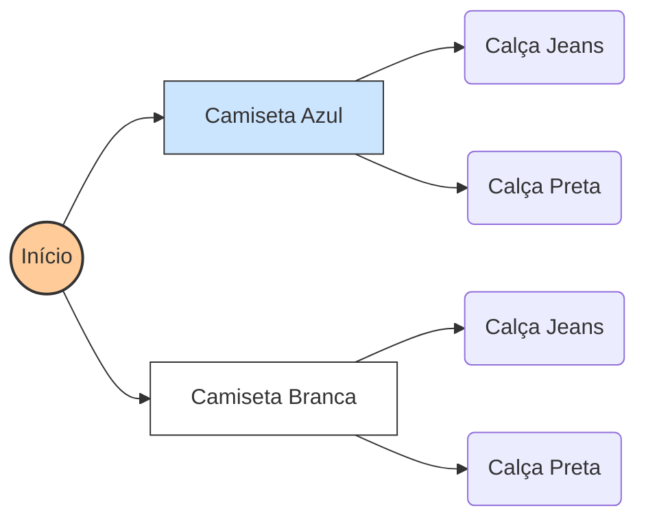
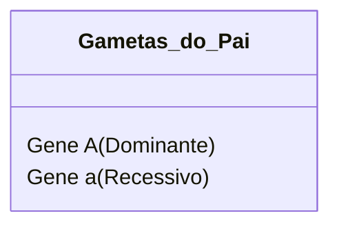

# Problemas de Contagem e o Princípio Multiplicativo

## Conceitos

### O Desafio de Contar e Combinar no Nosso Dia a Dia
Você já parou para pensar em como a **contagem** está presente na nossa vida? Desde muito pequenos, aprendemos a contar brinquedos, lápis de cor e os dias da semana. No começo, contamos as coisas de uma em uma, apontando o dedo e dizendo os números em sequência: um, dois, três e assim por diante. 

Essa contagem simples, de um em um, é muito útil quando temos poucos objetos. Mas o que acontece quando precisamos descobrir o total de opções em situações mais cheias de detalhes? 

Imagine que você está em uma sorveteria que oferece **3 tipos de casquinha** e **5 sabores de sorvete**. Se você quiser experimentar cada combinação diferente de casquinha com um sabor de sorvete, quantas opções você terá ao todo?

Contar todas essas opções de cabeça ou desenhar cada sorvete no papel pode demorar bastante. É aí que entra o **raciocínio combinatório**. 

O raciocínio combinatório é uma forma de organizar as nossas escolhas e calcular o total de possibilidades de maneira inteligente e rápida, sem precisar contar de um em um. Ele nos ajuda a pensar de forma organizada e a encontrar caminhos para resolver problemas de contagem que parecem complicados à primeira vista.

---

### Entendendo as Coleções e as Combinações
Para entender como a matemática resolve esses problemas, precisamos conhecer duas ideias muito importantes: as **coleções** e as **combinações**.

Uma **coleção** (ou conjunto) é simplesmente um grupo de coisas que têm algo em comum. Por exemplo:
*   A coleção de roupas que você tem no armário;
*   A lista de pratos no cardápio de um restaurante;
*   Os números que podemos escolher para criar uma senha.

Quando falamos em **combinar** elementos de duas coleções diferentes, estamos criando **pares** formados por um item da primeira lista e um item da segunda lista. 

Por exemplo, se a primeira coleção (Coleção A) tem tipos de camisetas e a segunda coleção (Coleção B) tem tipos de bermudas, cada combinação será uma dupla formada por uma camiseta **e** uma bermuda. 

Na matemática, quando juntamos todos os pares possíveis combinando cada elemento de uma lista com todos os elementos de outra lista, chamamos esse resultado de **produto de duas coleções**. 

Cada par formado segue uma ordem simples: escolhemos primeiro um item da primeira lista e, depois, um item da segunda lista. Se mudarmos as opções de cada lista, criamos combinações diferentes.

O nosso grande desafio é descobrir: **quantas combinações diferentes podemos formar ao todo?** Para responder a isso de forma simples e visual, usamos recursos que nos ajudam a organizar o pensamento.

---

### Recursos Visuais para Organizar as Possibilidades
Quando temos muitas opções para combinar, o nosso cérebro pode se perder facilmente se tentarmos lembrar de tudo sem anotar. Por isso, os matemáticos usam desenhos e esquemas para organizar as ideias. 

Duas ferramentas práticas e muito fáceis de usar são as **tabelas de dupla entrada** e as **árvores de possibilidades**.

#### 1. Tabelas de Dupla Entrada
A tabela de dupla entrada é uma grade organizada em linhas e colunas. Ela é perfeita quando estamos combinando exatamente **duas coleções** de coisas.

Para montar essa tabela, fazemos assim:
*   Escrevemos as opções da primeira coleção nas **linhas** (na vertical, apontando para baixo);
*   Escrevemos as opções da segunda coleção nas **colunas** (na horizontal, apontando para o lado);
*   Em cada quadradinho onde uma linha se cruza com uma coluna, registramos a **combinação** daquela linha com aquela coluna.

Imagine que estamos combinando camisetas e calças. A nossa tabela ficaria parecida com esta:

| Camisetas (Linhas) $\downarrow$ \ Calças (Colunas) $\rightarrow$ | Calça Jeans | Calça Preta |
| :--- | :---: | :---: |
| **Camiseta Azul** | Camiseta Azul + Calça Jeans | Camiseta Azul + Calça Preta |
| **Camiseta Branca** | Camiseta Branca + Calça Jeans | Camiseta Branca + Calça Preta |

Olhando para essa tabela, você consegue perceber que ela se parece com um tabuleiro ou uma barra de chocolate dividida em quadradinhos? 

A quantidade total de quadradinhos preenchidos representa o **total de combinações**. Para descobrir esse total sem contar de um em um, basta multiplicar a quantidade de linhas pela quantidade de colunas:
$$Total de combinações = 2  linhas \times 2  colunas = 4  opções$$

A tabela de dupla entrada é excelente porque nos mostra de forma clara e limpa todas as opções. No entanto, ela tem um ponto fraco: se você quiser combinar uma terceira coleção (como tipos de tênis), fica muito difícil desenhar uma tabela que mostre três coisas ao mesmo tempo no papel.

#### 2. Árvore de Possibilidades (Diagrama de Árvore)
A **árvore de possibilidades** é um desenho que nos ajuda a visualizar as decisões como se fossem caminhos ou ramificações de uma árvore. Ela é maravilhosa porque funciona para duas, três ou muitas coleções de coisas.

Para desenhar uma árvore de possibilidades, seguimos estes passos simples:
1.  **Ponto de Partida**: Começamos com um ponto no lado esquerdo da folha, que representa o momento antes de fazermos qualquer escolha.
2.  **Primeiro Nível (Primeira Escolha)**: A partir do ponto de partida, puxamos linhas (galhos) para cada opção da primeira coleção. Se tivermos 2 camisetas, puxamos 2 linhas.
3.  **Segundo Nível (Segunda Escolha)**: Na ponta de cada um dos galhos que desenhamos, puxamos novas linhas para representar as opções da segunda coleção. Se tivermos 3 calças, puxamos 3 linhas a partir de cada camiseta.
4.  **Pontas Finais**: As pontas dos últimos galhos representam as combinações completas. Se contarmos quantas pontas existem no final do desenho, descobriremos o total de combinações.

Veja este esquema visual simples de como as escolhas se ramificam:

Cada caminho que você percorre, desde o "Início" até a ponta direita, representa uma roupa completa que você montou. Contando as pontas do lado direito, vemos que temos 4 combinações possíveis.

---

### O Princípio Multiplicativo: O Atalho da Matemática
Agora que você já sabe usar tabelas e árvores de possibilidades, vamos conhecer o maior segredo dos matemáticos para resolver problemas de contagem de forma rápida: o **Princípio Multiplicativo**.

Para entender como ele funciona, pense na multiplicação como uma forma mais rápida de fazer uma conta de somar. 

Se você tem **3 pratos principais** em um restaurante e, para cada um deles, pode escolher entre **4 tipos de sobremesa**, você pode descobrir o total de opções somando o número de sobremesas para cada prato:
$$Total = 4  (para o prato 1) + 4  (para o prato 2) + 4  (para o prato 3) = 12  opções$$

Somar $4 + 4 + 4$ é o mesmo que fazer a conta de multiplicar $3 \times 4$. 

O **Princípio Multiplicativo** diz exatamente isso: em problemas de contagem onde combinamos escolhas independentes, podemos encontrar o total multiplicando o número de opções de cada escolha.

A regra geral é muito simples:
$$Total de possibilidades = Opções da 1ª escolha \times Opções da 2ª escolha$$

E se tivéssemos três escolhas consecutivas, como camisetas, calças e tênis? O princípio continua funcionando da mesma forma! Basta multiplicar todas as etapas:
$$Total = Opções da 1ª escolha \times Opções da 2ª escolha \times Opções da 3ª escolha$$

Esse atalho matemático é fantástico porque nos poupa de desenhar árvores gigantescas ou tabelas enormes quando os números de opções são grandes. Imagine o trabalho de desenhar uma árvore de possibilidades para combinar 15 tipos de camisas com 10 tipos de calças! Com o princípio multiplicativo, fazemos apenas a conta $15 \times 10 = 150$ combinações, em poucos segundos.

---

## Exemplos (Na Prática)

A seguir, veremos como aplicar essas ideias na prática através de situações do cotidiano. Vamos usar tabelas, diagramas e contas de multiplicar para entender bem cada caso.

### Exemplo 1: O Lanche na Cantina
**Cenário**: Na cantina da escola, a hora do lanche é sempre divertida. Você pode montar um combo escolhendo um sanduíche e um tipo de suco. O cardápio do dia tem as seguintes opções:
*   **Sanduíches**: Natural de Frango, Misto-Quente, Queijo Branco. (3 opções)
*   **Sucos**: Laranja, Uva, Morango, Maracujá. (4 opções)

Quantas combinações diferentes de lanche (com um sanduíche e um suco) você pode montar?

#### Resolução Passo a Passo:

**1. Identificando as opções**:
*   Primeira escolha (Sanduíches): temos **3 opções**.
*   Segunda escolha (Sucos): temos **4 opções**.

**2. Organizando com uma Tabela de Dupla Entrada**:
Vamos escrever os sanduíches nas linhas e os sucos nas colunas para ver todas as refeições possíveis.

| Sanduíches $\downarrow$ \ Sucos $\rightarrow$ | Laranja | Uva | Morango | Maracujá |
| :--- | :---: | :---: | :---: | :---: |
| **Natural de Frango** | Frango + Laranja | Frango + Uva | Frango + Morango | Frango + Maracujá |
| **Misto-Quente** | Misto + Laranja | Misto + Uva | Misto + Morango | Misto + Maracujá |
| **Queijo Branco** | Queijo + Laranja | Queijo + Uva | Queijo + Morango | Queijo + Maracujá |

Cada célula da tabela mostra uma opção de lanche combinado. Contando todos os quadradinhos da tabela, temos 12 combinações possíveis.

**3. Descrevendo com a Árvore de Possibilidades**:
Podemos desenhar ou escrever os caminhos das escolhas:
*   Se escolhermos o sanduíche **Natural de Frango**, temos 4 caminhos de sucos: Laranja, Uva, Morango ou Maracujá. (4 opções)
*   Se escolhermos o sanduíche **Misto-Quente**, temos mais 4 caminhos de sucos: Laranja, Uva, Morango ou Maracujá. (4 opções)
*   Se escolhermos o sanduíche **Queijo Branco**, temos outros 4 caminhos de sucos: Laranja, Uva, Morango ou Maracujá. (4 opções)

Somando os caminhos das pontas, temos:
$$Total = 4 + 4 + 4 = 12  caminhos$$

**4. Usando o Princípio Multiplicativo**:
Para ir direto ao ponto, multiplicamos as possibilidades da primeira decisão pelas possibilidades da segunda decisão:
$$Total de combinações = 3  sanduíches \times 4  sucos = 12$$

**Conclusão**: Você pode montar seu lanche de 12 maneiras diferentes na cantina.

---

### Exemplo 2: A Escolha da Roupa para a Festa
**Cenário**: Lucas está escolhendo a roupa para a festa de aniversário de seu melhor amigo. Ele quer combinar uma camiseta, uma calça e um par de calçados de forma bem legal. Ele separou as seguintes opções do seu armário:
*   **Camisetas**: Camiseta Verde, Camiseta Azul. (2 opções)
*   **Calças**: Calça Jeans, Calça Preta, Calça Cinza. (3 opções)
*   **Calçados**: Tênis Esportivo, Sapato Social. (2 opções)

De quantas maneiras diferentes Lucas pode se vestir combinando essas peças?

#### Resolução Passo a Passo:

Como temos três coleções de coisas para combinar (camisetas, calças e calçados), a melhor forma de organizar visualmente é desenhando a árvore de possibilidades.

**1. Descrevendo os caminhos da Árvore de Possibilidades**:
*   Primeiro, Lucas escolhe a **Camiseta** (2 opções: Verde ou Azul):
    *   **Opção 1: Camiseta Verde**
        *   Depois, ele escolhe a **Calça** (3 opções: Jeans, Preta ou Cinza):
            *   Se for Calça Jeans, ele escolhe o **Calçado** (Tênis ou Sapato) $\implies$ **(Verde, Jeans, Tênis)** ou **(Verde, Jeans, Sapato)**
            *   Se for Calça Preta, ele escolhe o **Calçado** (Tênis ou Sapato) $\implies$ **(Verde, Preta, Tênis)** ou **(Verde, Preta, Sapato)**
            *   Se for Calça Cinza, ele escolhe o **Calçado** (Tênis ou Sapato) $\implies$ **(Verde, Cinza, Tênis)** ou **(Verde, Cinza, Sapato)**
    *   **Opção 2: Camiseta Azul**
        *   Depois, ele escolhe a **Calça** (3 opções: Jeans, Preta ou Cinza):
            *   Se for Calça Jeans, ele escolhe o **Calçado** (Tênis ou Sapato) $\implies$ **(Azul, Jeans, Tênis)** ou **(Azul, Jeans, Sapato)**
            *   Se for Calça Preta, ele escolhe o **Calçado** (Tênis ou Sapato) $\implies$ **(Azul, Preta, Tênis)** ou **(Azul, Preta, Sapato)**
            *   Se for Calça Cinza, ele escolhe o **Calçado** (Tênis ou Sapato) $\implies$ **(Azul, Cinza, Tênis)** ou **(Azul, Cinza, Sapato)**

Se contarmos as opções que estão em negrito no final de cada caminho, descobriremos que existem 12 combinações completas de roupas.

**2. Usando o Princípio Multiplicativo**:
Podemos resolver essa situação de forma muito mais rápida multiplicando o número de opções de cada tipo de peça:
$$Total = Camisetas \times Calças \times Calçados$$
$$Total = 2 \times 3 \times 2$$

Fazendo a conta por etapas:
*   Multiplicamos os dois primeiros números: $2 \times 3 = 6$
*   Multiplicamos o resultado pelo terceiro número: $6 \times 2 = 12$

**Conclusão**: Lucas tem 12 maneiras diferentes de combinar suas peças de roupa para a festa.

---

### Exemplo 3: Criando a Senha do Jogo de Tabuleiro
**Cenário**: Mariana e seus amigos criaram um jogo de tabuleiro personalizado. Para começar a jogar, cada participante precisa inventar uma senha secreta que tenha duas partes: a primeira parte deve ser uma **vogal** maiúscula e a segunda parte deve ser um **número ímpar** de 1 a 7.
*   **Vogais permitidas**: A, E, I, O, U. (5 opções)
*   **Números ímpares permitidos**: 1, 3, 5, 7. (4 opções)

Quantas senhas diferentes os jogadores podem inventar seguindo essas regras?

#### Resolução Passo a Passo:

**1. Analisando as regras**:
*   Para a primeira parte da senha (a vogal), temos **5 opções** de escolha;
*   Para a segunda parte da senha (o número ímpar), temos **4 opções** de escolha.

**2. Listando todas as combinações de forma organizada**:
Para garantir que não esqueceremos nenhuma senha, podemos fazer uma lista ordenada, fixando uma vogal de cada vez:
*   Com a vogal **A**: A1, A3, A5, A7 (4 senhas)
*   Com a vogal **E**: E1, E3, E5, E7 (4 senhas)
*   Com a vogal **I**: I1, I3, I5, I7 (4 senhas)
*   Com a vogal **O**: O1, O3, O5, O7 (4 senhas)
*   Com a vogal **U**: U1, U3, U5, U7 (4 senhas)

Somando todas as opções: $4 + 4 + 4 + 4 + 4 = 20$ senhas.

**3. Usando o Princípio Multiplicativo**:
Aplicando a regra da multiplicação de forma direta, temos:
$$Total de senhas = 5  vogais \times 4  números ímpares = 20$$

**Conclusão**: Os participantes do jogo podem inventar 20 senhas diferentes.

---

### Exemplo 4: Montando um Skate Personalizado
**Cenário**: Uma loja de esportes tem um site onde você pode montar seu próprio skate de brinquedo para colecionar. Você deve escolher os componentes em três passos:
*   **Passo 1 (Prancha de madeira)**: Você pode escolher entre 4 cores de prancha.
*   **Passo 2 (Modelo de rodinhas)**: Estão disponíveis 3 tipos diferentes de rodinhas.
*   **Passo 3 (Adesivo para decorar)**: Existem 5 modelos de adesivos.

Quantos modelos diferentes de skates podem ser montados no site?

#### Resolução Passo a Passo:

**1. Identificando as opções em cada etapa**:
*   Primeira escolha (Cores da prancha): **4 opções**
*   Segunda escolha (Tipos de rodinhas): **3 opções**
*   Terceira escolha (Modelos de adesivos): **5 opções**

**2. Usando o Princípio Multiplicativo**:
Como as escolhas são independentes uma da outra, basta multiplicar o número de opções de cada componente para saber o total de skates diferentes:
$$Total de designs = Pranchas \times Rodinhas \times Adesivos$$
$$Total de designs = 4 \times 3 \times 5$$

Fazendo os cálculos por partes:
*   Primeiro produto: $4 \times 3 = 12$
*   Segundo produto: $12 \times 5 = 60$

**Conclusão**: O site permite criar 60 modelos diferentes de skates de brinquedo.

---

## Erros Comuns

Quando estamos aprendendo a combinar coleções e usar a contagem, é muito comum cometermos alguns enganos. A tabela abaixo ajuda a identificar esses erros comuns, explica por que eles acontecem e mostra como pensar de forma correta.

| Padrão de Erro | Explicação do Erro | Raciocínio Corretivo (Como Pensar Certo) |
| :--- | :--- | :--- |
| **Somar as opções em vez de multiplicar** | O estudante olha para as coleções de opções e faz uma conta de somar. Por exemplo, no caso dos 3 sanduíches e 4 sucos, ele faz $3 + 4 = 7$ combinações. | Pense que você não precisa escolher **ou** um sanduíche **ou** um suco (o que daria 7 opções ao todo se você pudesse pegar só uma coisa). Você vai pegar as duas coisas juntas: um sanduíche **e** um suco. Cada sanduíche se conecta com todos os sucos, por isso multiplicamos: $3 \times 4 = 12$. |
| **Esquecer ramos na árvore de possibilidades** | Ao desenhar a árvore, o aluno desenha as ramificações de forma desigual. Ele coloca 4 sucos para o sanduíche de frango, mas desenha apenas 2 sucos para o misto-quente. | Lembre-se de que a árvore de possibilidades deve ser certinha e regular em problemas de coleções independentes. Se temos 4 tipos de suco, **cada um** dos sanduíches deve ter exatamente 4 galhos de suco saindo dele. Desenhe com atenção, alinhando as pontas. |
| **Achar que a ordem dos itens cria combinações repetidas** | O estudante acha que escolher "Sanduíche de Frango e Suco de Laranja" é uma combinação diferente de escolher "Suco de Laranja e Sanduíche de Frango", contando a mesma opção duas vezes. | Entenda que o lanche final é o mesmo, não importa qual você escolha colocar primeiro na bandeja. Quando combinamos itens de duas listas diferentes, cada par representa um grupo. "Frango + Laranja" é exatamente o mesmo lanche que "Laranja + Frango", então contamos essa combinação apenas uma vez. |
| **Esquecer opções na hora de listar de cabeça** | Tentar listar todas as combinações escrevendo uma por uma sem uma ordem definida, acabando por esquecer várias opções ou repetir algumas sem querer. | Não faça de cabeça! Use sempre a organização sistemática. Fixe o primeiro item da Coleção A e combine com todos da Coleção B. Depois, passe para o segundo de A e combine com todos de B, repetindo esse processo até o fim da lista. |

---

## Conexões Interdisciplinares

A habilidade de combinar elementos e calcular possibilidades de contagem é muito útil em outras áreas do conhecimento, nos ajudando a compreender fenômenos científicos e resolver desafios do mundo real.

### 1. Genética e Ciências Naturais (Biologia)
Você já percebeu como somos parecidos com nossos pais, mas ao mesmo tempo únicos? Isso acontece por causa da **genética**. As nossas características físicas (como a cor dos olhos, o tipo de cabelo e a altura) são determinadas por genes que herdamos do nosso pai (Coleção A) e da nossa mãe (Coleção B). 

Na ciência, os pesquisadores usam um quadro de combinações chamado **Quadrado de Punnett**, que funciona exatamente como uma tabela de dupla entrada. Ele serve para mostrar todas as combinações possíveis de genes que um filho pode herdar. 

Por exemplo, se o pai tem duas opções de genes para mandar (vamos chamá-las de **A** e **a**) e a mãe também tem duas opções (**A** e **a**), o quadrado de combinações nos mostra que existem 4 combinações possíveis para o bebê: **AA**, **Aa**, **aA** ou **aa**. A análise dessas combinações ajuda os cientistas a entender as chances de uma pessoa nascer com olhos azuis ou castanhos, por exemplo.

### 2. Culinária, Nutrição e Saúde
Os profissionais que cuidam da nossa alimentação, chamados de nutricionistas, usam o raciocínio combinatório para planejar os cardápios de escolas, hospitais e restaurantes. Eles precisam combinar alimentos de diferentes coleções para criar refeições que sejam saudáveis, equilibradas e saborosas.

Imagine que um nutricionista precise montar pratos combinando:
*   **Carboidratos** (Arroz, Purê ou Macarrão);
*   **Proteínas** (Frango, Carne ou Peixe);
*   **Legumes** (Cenoura, Brócolis ou Abobrinha).

Utilizando a conta de multiplicar, ele sabe que pode montar:
$$Refeições = 3  carboidratos \times 3  proteínas \times 3  legumes = 27  pratos diferentes$$

Dessa forma, é possível garantir que os estudantes tenham pratos variados todos os dias do mês, sem repetir o cardápio.

### 3. Tecnologia e a Segurança das nossas Senhas
Sempre que criamos uma conta em um jogo de computador ou uma rede social, precisamos inventar uma **senha**. A segurança dessa senha contra invasores depende diretamente do princípio multiplicativo!

Se uma senha de cofre precisa ter apenas 3 números (de 0 a 9), o total de senhas possíveis que alguém pode tentar adivinhar é:
$$Senhas = 10 \times 10 \times 10 = 1.000  possibilidades$$

Agora, se o sistema exigir que a senha misture letras maiúsculas, letras minúsculas, números e símbolos especiais, a quantidade de opções em cada etapa da senha aumenta muito. 

Com o aumento de opções, o número de combinações cresce de forma gigantesca, tornando a senha extremamente forte e muito difícil de ser descoberta por computadores invasores. É a matemática das combinações protegendo as nossas informações na internet!

---

## Resumo para Revisão

*   **Raciocínio Combinatório**: É a maneira matemática de pensar que nos ajuda a descobrir o número total de combinações possíveis em uma situação de escolha, sem que seja necessário contar de um em um.
*   **Combinar Coleções**: Significa formar duplas (pares ordenados) pegando um item de uma Coleção A e juntando-o com um item de uma Coleção B.
*   **Tabela de Dupla Entrada**: Uma grade com linhas e colunas muito útil para organizar e contar combinações de **duas coleções**. Para descobrir o total de opções na tabela, multiplicamos o número de linhas pelo número de colunas.
*   **Árvore de Possibilidades**: Um esquema visual desenhado na forma de galhos que mostra a sequência de escolhas passo a passo. É a ferramenta mais indicada quando temos **três ou mais coleções** para combinar.
*   **Princípio Multiplicativo**: O atalho rápido que nos diz para multiplicar a quantidade de opções de cada escolha para encontrar o total de combinações possíveis:
    $$Total = Opções da escolha 1 \times Opções da escolha 2 \times Opções da escolha 3$$
*   **Próximo Tópico**: Compreender como combinamos coleções e multiplicamos opções nos prepara para o estudo da **Álgebra**, onde aprenderemos sobre as propriedades da igualdade, noções de equivalência e como usar letras para representar números desconhecidos. Para continuar seus estudos de Matemática do 5º Ano do Ensino Fundamental, acesse o e-book do próximo capítulo: [../../cap-09-algebra/ebooks/ef05ma10.md](file:///c:/Users/nepov/Documents/Pessoal/Antigravity/🚀%20Educamob%20-%20DevOps%20e%20Infra/content/fundamental-1/5-ano/matematica/cap-09-algebra/ebooks/ef05ma10.md).

---

## Referências

*   BRASIL. Ministério da Educação. **Base Nacional Comum Curricular**. Brasília: MEC, 2018. Disponível em: <http://basenacionalcomum.mec.gov.br/>. Acesso em: 14 jul. 2026.
*   MORGADO, Augusto César; CARVALHO, João Bosco Pitombeira de; PINTO, Paulo Cezar Carvalho; FERNANDEZ, Pedro. **Análise Combinatória e Probabilidade**. 10. ed. Rio de Janeiro: SBM (Sociedade Brasileira de Matemática), 2016. (Coleção do Professor de Matemática).
*   OBMEP. **Métodos de Contagem e Probabilidade**. Rio de Janeiro: IMPA, 2015. (Material Didático do Programa de Iniciação Científica da Olimpíada Brasileira de Matemática das Escolas Públicas).
*   OPENSTAX. **Prealgebra 2e**. Houston, Texas: Rice University/OpenStax, 2020. Disponível em: <https://openstax.org/details/books/prealgebra-2e>. Acesso em: 14 jul. 2026.
*   SILVA, J. R.; SANTOS, M. A. O Raciocínio Combinatório nos Anos Iniciais do Ensino Fundamental: Uma Análise de Erros e Dificuldades. **Revista Brasileira de Educação em Ciências e Matemática**, v. 4, n. 2, p. 120-135, 2021. Disponível em SciELO Brasil.

---
> **Nota do Arquiteto:** Este e-book é 100% teórico. Os 60 exercícios correspondentes a este Objeto de Conhecimento deverão ser gerados posteriormente em um arquivo separado (`ef05ma09-exercicios.md`) utilizando a skill **Exercise Creator**.
